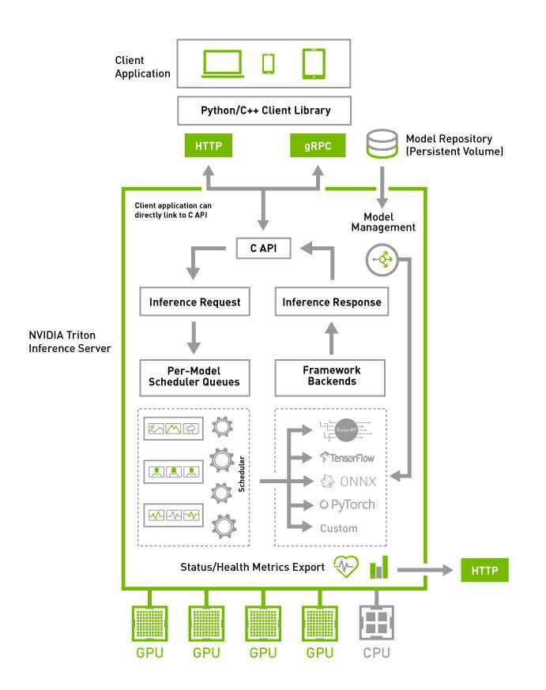
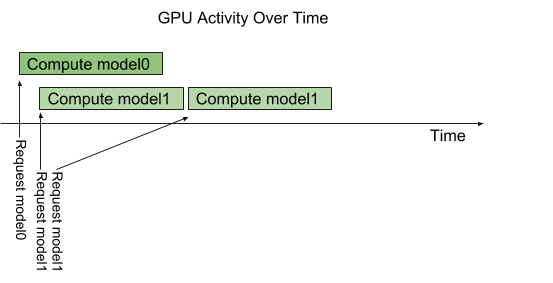
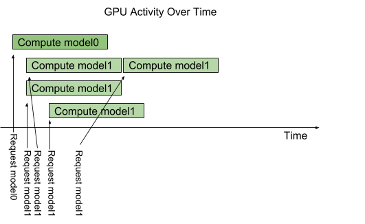

# Triton架构

下图显示了Triton Inference Server的架构。[模型仓库](https://docs.nvidia.com/deeplearning/triton-inference-server/user-guide/docs/user_guide/model_repository.html)是一个基于文件系统的模型存储库，Triton会将里面的模型部署并用于推理。推理请求通过[HTTP/REST、GRPC、C API](https://docs.nvidia.com/deeplearning/triton-inference-server/user-guide/docs/user_guide/architecture.html)来访问到服务，推理服务通过路由的机制调度相应的模型。Triton实现了多个调度和批处理算法，这些算法可以在逐个模型的基础上进行配置。每个模型的调度器可选地执行推理请求的批处理，然后将请求转发到与模型类型对应的后端。后端使用批处理请求中提供的输入执行推理，以生成所请求的输出。然后返回输出。

Triton支持C API后端，它允许Triton扩展新的功能，例如自定义前处理和后处理操作，甚至可以自定义一个新的深度学习框架。

Triton部署的模型可以通过HTTP/REST或GRPC协议或C API提供的专用的模型管理API进行查询和控制。

Triton提供了Readiness和liveness的健康检查以及利用率、吞吐量和延迟等指标，方便与K8s进行集成。

## 并发调用模型

Triton允许多个模型或者同一个模型的多个实例在同一个系统上并行地执行。系统可能有0个、1个或者多个GPU。下图展示了一个带有两个模型的示例，Model0和model1。假设Triton当前没有处理任何请求，当两个请求同时到达时，每个模型各一个请求，Triton立即将它们调度到GPU上，GPU的硬件调度器开始并行处理这两个计算。在CPU上执行的模型也是类似，除了执行每个模型的CPU线程的调度由操作系统处理。

默认情况下，如果同一个模型的多个请求同时到达，Triton每次只会在GPU上执行一个调度，也就是串行化地执行，如下图所示。

Triton提供了一个名为`instance_group`的模型配置选项，它允许每个模型指定应该允许多少个模型并行执行，也称作实例。默认情况下，系统中有几个可用的GPU，Triton会为每个模型提供几个实例。通过在模型配置中使用`instance_group`字段，可以更改模型的执行实例数量。下图展示了将model1配置为3个实例时的执行情况。如图所示，前三个model1推理请求立即并行执行。第四个model1推理请求必须等到前三个执行中的一个完成后才能开始。

## 模型和调度器

Triton支持多个调度和批处理算法，每个模型可以进行独立选择不同的算法。本章节介绍无状态模型、有状态模型和集成模型，以及Triton如何提供调度器来支持这些模型的类型。对于具体的模型，根据模型配置文件来决定调度程序的选择。

### 无状态模型

无状态模型在推理请求之间不维护状态。在无状态模型上执行的每个推理都独立于使用该模型的所有其他推理。

一个典型的无状态模型的例子是CNN，例如图像分类和目标检测。无状态模型可以使用默认调度器或动态批处理器作为调度器。

RNN和一些具有内存的模型也可以是无状态的，只要它们保持的状态不跨越推理请求。例如，如果在批次推理请求之间没有携带内部状态，则Triton认为遍历批次中所有元素的RNN是无状态的。默认调度器可用于这些无状态模型。动态批处理器不能使用，因为模型通常不期望批处理表示多个推理请求。

### 有状态模型

## Ensemble模型

Ensemble模型（集成模型）表示了一个或者多个模型通过输入和输出连接成的模型管道。Ensemble模型可以用于封装涉及多个模型的情景，例如"数据前处理->推理->数据后处理"。这样就可以使用Ensemble模型来避免张量传输的开销，可以最大限度的减少发送到Triton的请求数量。

