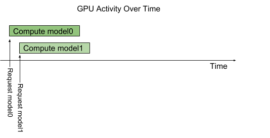
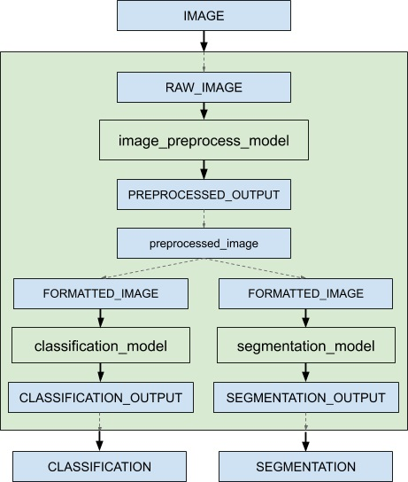

# Triton架构

下图显示了Triton Inference Server的架构。[模型仓库](https://docs.nvidia.com/deeplearning/triton-inference-server/user-guide/docs/user_guide/model_repository.html)是一个基于文件系统的模型存储库，Triton会将里面的模型部署并用于推理。推理请求通过[HTTP/REST、GRPC、C API](https://docs.nvidia.com/deeplearning/triton-inference-server/user-guide/docs/user_guide/architecture.html)来访问到服务，推理服务通过路由的机制调度相应的模型。Triton实现了多个调度和批处理算法，这些算法可以在逐个模型的基础上进行配置。每个模型的调度器可选地执行推理请求的批处理，然后将请求转发到与模型类型对应的后端。后端使用批处理请求中提供的输入执行推理，以生成所请求的输出。然后返回输出。

Triton支持C API后端，它允许Triton扩展新的功能，例如自定义前处理和后处理操作，甚至可以自定义一个新的深度学习框架。

Triton部署的模型可以通过HTTP/REST或GRPC协议或C API提供的专用的模型管理API进行查询和控制。

Triton提供了Readiness和liveness的健康检查以及利用率、吞吐量和延迟等指标，方便与K8s进行集成。


## 并发调用模型

Triton允许多个模型或者同一个模型的多个实例在同一个系统上并行地执行。系统可能有0个、1个或者多个GPU。下图展示了一个带有两个模型的示例，Model0和model1。假设Triton当前没有处理任何请求，当两个请求同时到达时，每个模型各一个请求，Triton立即将它们调度到GPU上，GPU的硬件调度器开始并行处理这两个计算。在CPU上执行的模型也是类似，除了执行每个模型的CPU线程的调度由操作系统处理。



默认情况下，如果同一个模型的多个请求同时到达，Triton每次只会在GPU上执行一个调度，也就是串行化地执行，如下图所示。


Triton提供了一个名为`instance_group`的模型配置选项，它允许每个模型指定应该允许多少个模型并行执行，也称作实例。默认情况下，系统中有几个可用的GPU，Triton会为每个模型提供几个实例。通过在模型配置中使用`instance_group`字段，可以更改模型的执行实例数量。下图展示了将model1配置为3个实例时的执行情况。如图所示，前三个model1推理请求立即并行执行。第四个model1推理请求必须等到前三个执行中的一个完成后才能开始。


## 模型和调度器

Triton支持多个调度和批处理算法，每个模型可以进行独立选择不同的算法。本章节介绍无状态模型、有状态模型和集成模型，以及Triton如何提供调度器来支持这些模型的类型。对于具体的模型，根据模型配置文件来决定调度程序的选择。

### 无状态模型

对于Triton调度器而言，无状态模型在推理请求之间不维护状态。在无状态模型上执行的每个推理都独立于使用该模型的所有其他推理。

一个典型的无状态模型的例子是CNN，例如图像分类和目标检测。无状态模型可以使用默认调度器或动态批处理器作为调度器。

RNN和一些具有内存的模型也可以是无状态的，只要它们保持的状态不跨越推理请求。例如，如果在批次推理请求之间没有携带内部状态，则Triton认为遍历批次中所有元素的RNN是无状态的。默认调度器可用于这些无状态模型。动态批处理器不能使用，因为模型通常不期望批处理表示多个推理请求。

### 有状态模型

对于Triton调度器而言，一个有状态模型会维护推理请求之间的状态信息。模型期望多个推理请求形成一个推理序列，这些推理序列必须被路由到同一个模型实例，以便模型维护的状态被正确地更新。此外，该模型可能要求Triton提供控制信号，例如指示序列的开始和结束。

序列批处理程序（[sequence batcher](https://docs.nvidia.com/deeplearning/triton-inference-server/user-guide/docs/user_guide/model_configuration.html#sequence-batcher)）必须用于这些有状态模型。如下所述，序列批处理程序确保将序列中所有的推理请求路由到相同的模型实例，以便模型能够正确维护状态。序列批处理程序还与模型进行通信，以指示序列何时开始，何时结束，何时准备好执行推断请求，以及序列的相关ID。

当对有状态模型进行推理请求时候，客户端应用程序必须为序列中的所有请求提供相同的相关ID，还必须标记序列的开始和结束。相关性ID允许Triton识别请求属于同一个序列。

#### Control Inputs


## Ensemble模型

Ensemble模型（集成模型）表示了一个或者多个模型通过输入和输出连接成的模型管道。Ensemble模型可以用于封装涉及多个模型的情景，例如"数据前处理->推理->数据后处理"。这样就可以使用Ensemble模型来避免张量传输的开销，可以最大限度的减少发送到Triton的请求数量。

集成调度器必须用于集成模型，而不管集成模型中的子模型使用什么调度器。对于集成调度器而言，集成模型并不是一个实际的模型。相反，它将集成模型中的子模型之间的数据流指定模型配置中的`ModelEnsembling::Step`条目。调度器收集每个步骤中的输出Tensor，根据规范将它们作为其他模型（步骤）的输入Tensor提供。尽管如此，从外部观点来看，集成模型仍然被视作单个模型。

注意，集成模型将继承相关模型的特征，因此请求头中的元数据必须与集成中的模型一致。例如，如果其中一个模型是有状态模型，那么对集成模型的推理请求应该包含有状态模型中提到的信息，这些信息将由调度器提供给有状态模型。

举一个例子，一个用于图像分类和分割的集成模型，它的配置如下所示：

```protobuf
name: "ensemble_model"
platform: "ensemble"
max_batch_size: 1
input [
  {
    name: "IMAGE"
    data_type: TYPE_STRING
    dims: [ 1 ]
  }
]
output [
  {
    name: "CLASSIFICATION"
    data_type: TYPE_FP32
    dims: [ 1000 ]
  },
  {
    name: "SEGMENTATION"
    data_type: TYPE_FP32
    dims: [ 3, 224, 224 ]
  }
]
ensemble_scheduling {
  step [
    {
      model_name: "image_preprocess_model"
      model_version: -1
      input_map {
        key: "RAW_IMAGE"
        value: "IMAGE"
      }
      output_map {
        key: "PREPROCESSED_OUTPUT"
        value: "preprocessed_image"
      }
    },
    {
      model_name: "classification_model"
      model_version: -1
      input_map {
        key: "FORMATTED_IMAGE"
        value: "preprocessed_image"
      }
      output_map {
        key: "CLASSIFICATION_OUTPUT"
        value: "CLASSIFICATION"
      }
    },
    {
      model_name: "segmentation_model"
      model_version: -1
      input_map {
        key: "FORMATTED_IMAGE"
        value: "preprocessed_image"
      }
      output_map {
        key: "SEGMENTATION_OUTPUT"
        value: "SEGMENTATION"
      }
    }
  ]
}
```

`ensemble_scheduling`的部分表明将使用集成调度器，并且集成模型由三个不同的模型组成。`step`部分中的每个元素指定要使用的模型，以及如何将模型的输入和输出映射到调度器识别的Tensor名称。例如，`step`中的第一个元素指定应该使用最新版本的`image_preprocess_model`，其输入`RAW_IMAGE`的内容由名为`IMAGE`的Tensor提供，其输出`PREPROCESSED_OUTPUT`的Tensor将映射到名为`preprocessed_image`的Tensor以供后面的模型使用。调度器识别的Tensor名称是Ensemble输入、Ensemble输出以及input_map和output_map中的所有值。

集成模型也可以具备动态批处理的能力。由于集成模型只是在组合模型之间路由数据，Triton可以在不修改集成配置的情况下将请求放入集成模型中，以利用组合模型的动态批处理。

对于Ensemble模型（包含前处理模型、分类模型、分割模型），客户端应用程序将它们视作四个不同的模型，可以进行独立地处理请求。集成调度器是如下图所示进行处理的。



当接收到集成模型的推理请求时，集成调度器将:

1. 识别出`IMAGE`这个Tensor是请求`RAW_IMAGE`这个前处理模型。
2. 检查集合中的模型，并向预处理模型发送内部请求，因为所需的所有输入Tensor都已准备好。
3. 识别内部请求的完成，收集输出Tensor并将内容映射到`preprocessed_image`，这是在集成中已知的唯一名称。
4. 将新收集的Tensor映射到集成中模型的输入。在这种情况下，`classification_model`和`segmentation_model`的输入将被映射并标记为就绪。
5. 检查需要新收集的Tensor的模型，并将内部请求发送给输入已准备好的模型，在本例中是分类模型和分割模型。请注意，响应的顺序是任意的，这取决于各个模型的负载和计算时间。
6. 重复步骤3-5，直到不再发送内部请求，然后使用映射到集合输出名称的张量响应推理请求。

## 额外的资源

您可以在以下链接中找到其他端到端集成示例:

- [This guide](https://github.com/triton-inference-server/tutorials/tree/main/Conceptual_Guide/Part_5-Model_Ensembles) explores the concept of ensembles with a running example.
- [Preprocessing in Python Backend Using Ensemble](https://github.com/triton-inference-server/python_backend#preprocessing)
- [Accelerating Inference with NVIDIA Triton Inference Server and NVIDIA DALI](https://developer.nvidia.com/blog/accelerating-inference-with-triton-inference-server-and-dali/)
- [Using RAPIDS AI with NVIDIA Triton Inference Server](https://github.com/rapidsai/rapids-examples/tree/main/rapids_triton_example)

